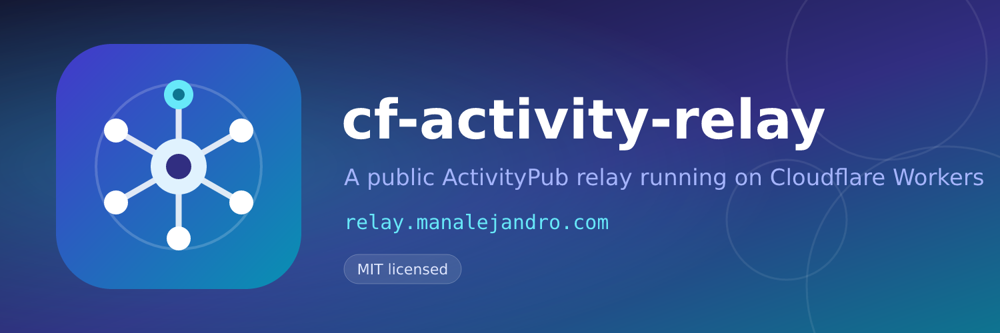

<p align="center">
	
</p>

# cf-activity-relay

An **ActivityPub relay** for the fediverse that runs entirely on **Cloudflare Workers**.

It implements the same federation model as the Go [Activity-Relay](https://github.com/thystra/Activity-Relay) server — traditional `/inbox` subscriptions, follower-style server actors, signed fan-out delivery, publisher accounting and a public `/status.json` — but replaces Redis, the worker processes and the CLI with Cloudflare's serverless platform: **D1** for state, **KV** for caching, **Queues** for delivery and **Workers** for the HTTP surface.

<p align="center">
	
</p>

## Features

- **Full relay actor** published as an ActivityStreams `Application` at `/actor`, with a stable RSA key, collections and `endpoints.sharedInbox`.
- **Two subscription styles**
  - Traditional: `Follow` with `object = https://www.w3.org/ns/activitystreams#Public` (Mastodon, Misskey, …) registers the sender's shared inbox.
  - Follower-style: `Follow` addressed to the relay actor (Pleroma, Akkoma, Friendica, NodeBB, …) with a reciprocal `Follow` and mutual-follow tracking.
- **HTTP signatures, both generations**
  - Legacy Fediverse profile (`Signature: keyId="…",algorithm="rsa-sha256",headers="…"`).
  - RFC 9421 HTTP Message Signatures with RFC 9530 `Content-Digest` and `nonce` replay protection. The verifier follows Mastodon's rule set — `@method`, `@target-uri` and `content-digest` must be covered — while preferring and fully supporting the Fediverse `tag="activitypub"` profile.
- **Destination-aware outbound signing** (`OUTBOUND_SIGNATURE_PROFILE`)
  - `dual` (default): unknown fetches probe RFC 9421 with one legacy fallback after an explicit signature challenge; unknown deliveries use legacy; capability evidence is cached per origin and scope.
  - `legacy` and `rfc9421` pin a single wire profile.
- **Relay-authored `Announce` wrappers** so the HTTP signer and JSON actor always agree, plus exact-body forwarding for Mastodon Linked-Data signed activities.
- **NodeBB-style embedded `Announce` normalisation** and referenced-`Announce` relaying with canonical loop protection.
- **Public address distribution policy**: `explicit_public_only` (default) or `public_and_unlisted`.
- **Abuse controls**: blocked and limited domain lists, person-only policy, manual approval with a pending queue, per-domain receiver health.
- **Bounded fan-out** with `MAX_FANOUT_TARGETS` and `MAX_QUEUE_JOBS`, domain de-duplication, and shared payloads that survive partial delivery failure.
- **Public status document** at `/status.json` (schema version 5) with connected instances, receiving instances, delivery health and publisher metadata.
- **WebFinger, NodeInfo 2.1**, empty privacy-filtered collections and a small landing page with live status.
- **Zero-cost cold start identity**: the relay RSA key is generated on first request and persisted in D1, or supplied as a secret.

## Architecture

```
                        ┌────────────────────────────────────────────────┐
   federation traffic   │              Cloudflare Worker                 │
  ─────────────────────▶│                                                │
   POST /inbox          │  router ─▶ /inbox  ─▶ verify ─▶ dispatch       │
   GET  /actor          │            /actor  ─▶ actor document           │
   GET  /status.json    │            /status.json ─▶ D1 aggregation      │
                        │            /.well-known/* ─▶ WebFinger/NodeInfo│
                        └───────┬───────────────┬───────────────┬────────┘
                                │               │               │
                        ┌───────▼──────┐ ┌──────▼──────┐ ┌──────▼────────┐
                        │  D1          │ │  KV         │ │  Queues       │
                        │  state       │ │  actor      │ │  fan-out      │
                        │  payloads    │ │  cache      │ │  retries      │
                        │  keys        │ │  capability │ │  DLQ          │
                        └──────────────┘ └─────────────┘ └──────┬────────┘
                                                                │ signed POST
                                                                ▼
                                                        remote shared inboxes
```

### Storage layout

| Binding | Product | Purpose |
| --- | --- | --- |
| `DB` | D1 | Relay identity, subscribers, followers, pending requests, publishers, blocked/limited domains, receiver health, queued payloads, nonces, capability evidence. |
| `CACHE` | KV | Remote actor documents (5 min) and negative lookup cache. |
| `DELIVERY_QUEUE` | Queues | One message per fan-out target plus a dead-letter queue. |
| `ASSETS` | Static assets | Landing page, logo, banner. |

### D1 tables

`relay_config`, `subscribers`, `followers`, `pending_requests`, `publishers`, `blocked_domains`, `limited_domains`, `receiver_health`, `activity_payloads`, `canonical_activities`, `signature_nonces`, `signature_capabilities`, `delivered_activities`.

The Worker applies the idempotent schema on cold start, so a fresh deployment works without a manual migration. `npm run db:migrate` is available for pre-provisioning.

## Endpoints

| Route | Methods | Description |
| --- | --- | --- |
| `/actor` | `GET`, `HEAD` | Relay actor document (`application/activity+json`). |
| `/actor/outbox`, `/actor/followers`, `/actor/following` | `GET`, `HEAD` | Empty, privacy-filtered `OrderedCollection`. |
| `/inbox` | `GET`, `HEAD`, `POST` | Shared inbox. `POST` accepts signed activities. |
| `/status.json` | `GET`, `HEAD` | Public status, schema version 5. |
| `/.well-known/webfinger` | `GET` | `acct:relay@<domain>` discovery. |
| `/.well-known/nodeinfo` | `GET` | NodeInfo discovery. |
| `/nodeinfo/2.1` | `GET` | NodeInfo 2.1 document. |
| `/admin/*` | `POST`/`GET` | Administrative API (requires `ADMIN_TOKEN`). |
| `/health` | `GET` | Liveness probe. |
| `/` | `GET` | Landing page with live status. |

## Deployment

### 1. Requirements

- A Cloudflare account with **Workers Paid** (Queues require it).
- A zone in the same account for the custom domain.
- Node.js 20+ and `wrangler` (installed as a dev dependency).

### 2. Provision resources

```bash
npx wrangler d1 create cf-activity-relay-db
npx wrangler kv namespace create CACHE
npx wrangler queues create cf-activity-relay-delivery
npx wrangler queues create cf-activity-relay-delivery-dlq
```

Copy the returned IDs into `wrangler.jsonc` (`d1_databases`, `kv_namespaces`).

### 3. Configure

Edit the `vars` block in `wrangler.jsonc` and the custom domain route:

```jsonc
"vars": {
	"RELAY_DOMAIN": "relay.example.org",
	"RELAY_SERVICENAME": "Example Relay",
	"RELAY_SUMMARY": "A public ActivityPub relay.",
	"RELAY_ICON": "https://relay.example.org/logo.png",
	"RELAY_IMAGE": "https://relay.example.org/banner.png",
	"PUBLIC_ADDRESS_DISTRIBUTION_POLICY": "explicit_public_only",
	"OUTBOUND_SIGNATURE_PROFILE": "dual",
	"PERSON_ONLY": "false",
	"MANUALLY_ACCEPT": "false",
	"MAX_ACTIVITY_BYTES": "1048576",
	"MAX_FANOUT_TARGETS": "5000",
	"MAX_QUEUE_JOBS": "100000"
},
"routes": [{ "pattern": "relay.example.org", "custom_domain": true }]
```

`RELAY_DOMAIN` is the canonical federation identity. The relay is deployed with `workers_dev: false` so the actor, key and endpoints cannot diverge across hostnames.

### 4. Apply the schema and deploy

```bash
npm run db:migrate        # optional: pre-create tables
npx wrangler secret put ADMIN_TOKEN
npx wrangler deploy
```

The relay key is generated automatically on the first request and stored in `relay_config`. To manage the key externally instead, upload it as a secret:

```bash
npx wrangler secret put RELAY_PRIVATE_KEY_PEM < actor.pem
```

Both PKCS#8 (`PRIVATE KEY`) and the historical PKCS#1 (`RSA PRIVATE KEY`) encodings are accepted.

### 5. Verify

```bash
curl -s https://relay.example.org/actor | jq .
curl -s https://relay.example.org/status.json | jq .
curl -s "https://relay.example.org/.well-known/webfinger?resource=acct:relay@relay.example.org" | jq .
```

## Configuration reference

| Variable | Default | Description |
| --- | --- | --- |
| `RELAY_DOMAIN` | — (required) | Bare public hostname. |
| `RELAY_SERVICENAME` | `ActivityPub Relay` | Name in the actor document. |
| `RELAY_SUMMARY` | empty | Actor `summary`. |
| `RELAY_ICON` | empty | Square logo URL (512×512 recommended). |
| `RELAY_IMAGE` | empty | Wide banner URL (1500×500 recommended). |
| `PUBLIC_ADDRESS_DISTRIBUTION_POLICY` | `explicit_public_only` | Or `public_and_unlisted`. |
| `OUTBOUND_SIGNATURE_PROFILE` | `dual` | `dual`, `legacy` or `rfc9421`. |
| `PERSON_ONLY` | `false` | Only `Person` actors may publish. |
| `MANUALLY_ACCEPT` | `false` | New subscriptions require manual approval. |
| `MAX_ACTIVITY_BYTES` | `1048576` | Inbound body limit (minimum 1024). |
| `MAX_FANOUT_TARGETS` | `5000` | Receivers per activity. |
| `MAX_QUEUE_JOBS` | `100000` | Maximum queued fan-out payloads. |
| `ADMIN_TOKEN` | unset | Secret; enables `/admin`. |
| `RELAY_PRIVATE_KEY_PEM` | unset | Secret; externally managed RSA key. |

`PERSON_ONLY` and `MANUALLY_ACCEPT` are runtime settings: the environment variables provide the initial value and the admin API can change them afterwards. The D1 values win.

## Admin API

Enabled only when `ADMIN_TOKEN` is set. Every request needs `Authorization: Bearer <ADMIN_TOKEN>`.

| Request | Description |
| --- | --- |
| `GET /admin/state` | Subscribers, followers, pending requests, publishers, blocked/limited lists, counts and settings. |
| `POST /admin/pending/:domain/accept` | Approve a pending follow: stores the receiver, sends `Accept` and the reciprocal `Follow` for follower-style requests. |
| `POST /admin/pending/:domain/reject` | Send `Reject` and drop the request. |
| `POST /admin/domains/:domain/block` | Block a domain (hard rejection). |
| `POST /admin/domains/:domain/unblock` | Remove a block. |
| `POST /admin/domains/:domain/limit` | Limit a domain (silently skipped, never receives reciprocal follows). |
| `POST /admin/domains/:domain/unlimit` | Remove a limit. |
| `POST /admin/settings` | Body `{"personOnly":true,"manuallyAccept":false}`. |
| `POST /admin/update` | Send an `Update` containing the relay actor to every receiver. |

Examples:

```bash
TOKEN=...
curl -s -H "Authorization: Bearer $TOKEN" https://relay.example.org/admin/state | jq .
curl -s -X POST -H "Authorization: Bearer $TOKEN" https://relay.example.org/admin/pending/mastodon.example/accept | jq .
curl -s -X POST -H "Authorization: Bearer $TOKEN" -H 'Content-Type: application/json' \
	-d '{"manuallyAccept":true}' https://relay.example.org/admin/settings | jq .
```

## Delivery and retries

1. An accepted activity is wrapped into a relay-signed `Announce` (or forwarded byte-for-byte when it carries a Mastodon `RsaSignature2017` proof) and stored once in `activity_payloads` with a remaining-delivery counter.
2. One queue message per receiver is produced with the concrete signature profile chosen **before** queueing. Profiles never change across retries.
3. The consumer signs the exact stored body and POSTs it to the receiver's shared inbox.
4. Retryable failures (network errors, `408`, `429`, `5xx`) are retried with the reference schedule `8 s, 13 s, 21 s, 34 s, 55 s`. Permanent failures (`3xx`, `4xx`) stop immediately.
5. `remain_count` is decremented only on success or final exhaustion, so one failing receiver can never delete the body another receiver still needs. Messages that exhaust queue retries land in the dead-letter queue, which also releases the payload.

Receiver health (`last_success_at`, `last_failure_at`, `consecutive_failures`, `total_successes`, `total_failures`) is recorded per delivery attempt and exposed through `/status.json`.

## Inbound processing

1. Body is read with a hard `MAX_ACTIVITY_BYTES` limit.
2. The signature profile is selected by the presence of `Signature-Input`: RFC 9421 or legacy.
3. The signer actor is resolved through KV or a **signed** remote `GET`; signature, digest and `Date`/`created` windows are verified. When the key is missing or the signature fails, the actor is re-fetched once (throttled) to pick up key rotation and recover from stale cache entries.
4. Actor/key host binding is enforced: the signature key, the activity actor and the actor document must share a hostname (canonical URL equality for RFC 9421).
5. RFC 9421 nonces are reserved in D1 **after** cryptographic verification, so replays are rejected without allowing unsigned traffic to consume nonces. Members tagged `activitypub` are preferred; untagged members are accepted so Mastodon's minimal fallback signature verifies.
6. The activity is dispatched by audience:
   - `to`/`cc` contains the Public collection → fan-out path (`Create`, `Update`, `Delete`, `Move`, `Announce`).
   - `to`/`cc` addresses the relay or a known follower's `/followers` → subscription path (`Follow`, `Undo`, `Accept`, `Reject`, `Announce`).
   - Public only in `cc` under the strict policy → publisher accounting only.
   - Everything else → `Follow`/`Undo` handling, otherwise `202`.

## Local development

```bash
npm install
npm run dev          # http://localhost:8787
npm test             # vitest with local D1/KV/Queues
npm run typecheck
```

`wrangler dev` uses local storage; the schema is created automatically. To pre-create it locally:

```bash
npm run db:migrate:local
```

Create a `.dev.vars` file for local secrets:

```dotenv
ADMIN_TOKEN=dev-token
```

## Testing

The suite runs inside `workerd` with the Cloudflare Vitest plugin and covers:

- RSA key generation, PEM/PKCS#1 handling and public-key derivation.
- Legacy and RFC 9421 sign/verify round trips, tamper rejection, digest matching.
- Domain normalization, SSRF guards, origin canonicalization.
- Public address distribution policy.
- Fan-out target de-duplication and exclusion.
- The full HTTP surface (`/actor`, collections, `/status.json`, WebFinger, NodeInfo).
- End-to-end inbox processing with a stubbed federation fetch: signed `Follow` (both signature profiles), unsigned and tampered rejection, strict-policy accounting and public fan-out payload creation.

## Security notes

- Delivery targets and actor URLs are validated; loopback and private IP literals are refused.
- The relay's own actor is resolved from local state. A Worker subrequest to the relay's own hostname can deadlock and time out, so self-host fetches are never attempted.
- Remote documents are read with hard byte limits, and redirects must stay on the same host.
- POST signatures must cover the `Digest`/`Content-Digest`, binding the body to the signature.
- `/status.json` never exposes inbox URLs, actor IDs, blocked-domain lists or queue internals.
- The relay key lives in D1 (or a Worker secret). Back up `relay_config` or keep `RELAY_PRIVATE_KEY_PEM` in a safe place — replacing the key changes the relay's federation identity.

## Project layout

```
src/
├── index.ts              Worker entry point (fetch, queue, scheduled)
├── config.ts             Environment configuration
├── env.ts                Binding and queue-message types
├── types.ts              ActivityPub domain types
├── ap/
│   ├── actor.ts          Actor, WebFinger and NodeInfo documents
│   ├── builders.ts       Announce/Accept/Reject/Follow/Update builders
│   ├── delivery.ts       Queue consumer with retries and health
│   ├── fanout.ts         Target selection and queue admission
│   ├── identity.ts       RSA identity lifecycle
│   ├── inbound.ts        Inbox verification and dispatch
│   ├── policy.ts         Public address distribution policy
│   └── remote.ts         Signed remote fetch and capability learning
├── crypto/
│   ├── digest.ts         SHA-256 helpers
│   ├── keys.ts           PEM/DER and RSA key handling
│   ├── legacy.ts         draft-cavage signatures
│   └── rfc9421.ts        RFC 9421 signatures and Content-Digest
├── db/schema.sql         D1 schema
├── routes/               HTTP handlers
├── store/repo.ts         D1 data access
└── utils/                Domain and HTTP helpers
public/                   Landing page, logo, banner
test/                     Vitest suite
```

## Relationship to other projects

- The relay behaviour, endpoint set, status schema and delivery semantics follow the Go [Activity-Relay](https://github.com/thystra/Activity-Relay) server (itself a maintained fork of [`yukimochi/Activity-Relay`](https://github.com/yukimochi/Activity-Relay)). This project is an independent TypeScript implementation for Cloudflare Workers, not a port of that codebase.
- The Worker-native patterns — dual-generation HTTP signatures, signed remote fetch, SSRF-safe fetch helpers and queue-based delivery — were informed by [`cf-activitypub-next`](https://github.com/manalejandro/cf-activitypub-next), an ActivityPub server for Cloudflare Workers.

## License

MIT — see [LICENSE](LICENSE).
